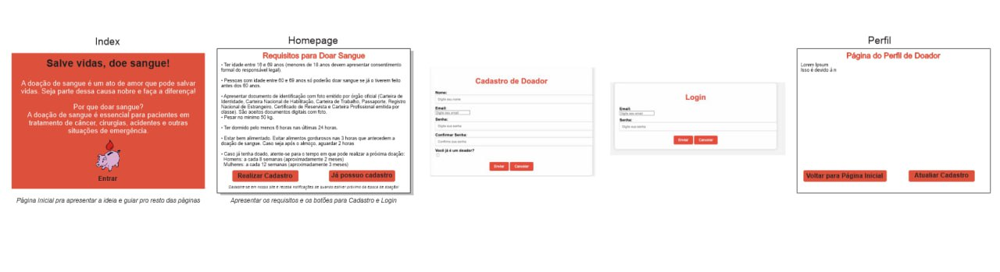

  
  <h1>Projeto Banco de Sangue: Aplicativo de controle de doações.</h1>
  <h3>Trabalho de Conclusão de Curso</h3>
  
Técnico em Desenvolvimento de Sistemas - EaDTEC.

<a href="#sobre">Sobre</a> | <a href="#tecnologias">Tecnologias</a> | <a href="#Layout">Layout</a> 

<h2 id="sobre">Sobre o projeto</h2>

Desenvolvimento de Sistema de Cadastro e Monitoramento de Doadores de Sangue, para o Trabalho de Conclusão de Curso (TCC) do Curso Técnico em Desenvolvimento de Sistemas. 

Integrantes: 
- [x] ADRIANO SATO
- [x] ALYSSON DA SILVEIRA
- [x] DARIO MATOS
- [x] DENISE MIGNOLI
- [x] LEANDRO UCHOAS
- [x] MONICA QUINTAL 

<h2 id="tecnologias">Tecnologias</h2>

- HTML e CSS.
- W3CSS.
- PHP.
- MySQL. 

<h2 id="layout">Layout</h2>

